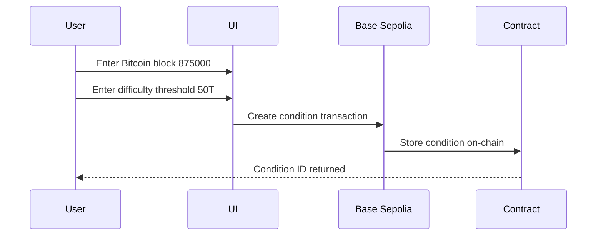
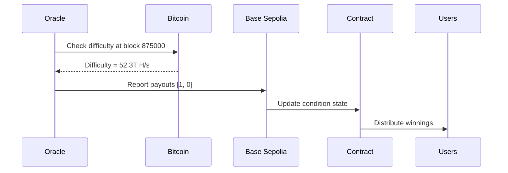

# 🔗 Doefin V2 - Blockchain Architecture

## Overview

Doefin V2 has a **dual-blockchain architecture** that's important to understand:

```
┌─────────────────────────────────────────────────────────────┐
│                      Doefin V2 Platform                     │
├─────────────────────────────────────────────────────────────┤
│                                                             │
│  ┌──────────────────────┐       ┌────────────────────────┐ │
│  │   Base Sepolia       │       │   Bitcoin Blockchain   │ │
│  │   (Contracts)        │       │   (Data Source)        │ │
│  ├──────────────────────┤       ├────────────────────────┤ │
│  │ • ConditionalTokens  │       │ • Mining Difficulty    │ │
│  │ • Market Contracts   │       │ • Block Heights        │ │
│  │ • Token Splits       │       │ • Difficulty Epochs    │ │
│  │ • Oracle Reports     │       │ • Network Hash Rate    │ │
│  │ • User Positions     │       │                        │ │
│  └──────────────────────┘       └────────────────────────┘ │
│           ↑                              ↓                  │
│           │                              │                  │
│           └──────── Oracle Reads ────────┘                  │
│              Bitcoin Data & Reports                         │
│                 to Base Sepolia                             │
└─────────────────────────────────────────────────────────────┘
```

## Two Blockchains Explained

### 1. **Base Sepolia** (Testnet for Base L2)
**Purpose:** Smart contract execution & token management  
**Block Height:** ~18,000,000+ (fast, L2 blocks)  
**Used For:**
- ✅ Deploying prediction market contracts
- ✅ Creating conditions
- ✅ Splitting positions
- ✅ Storing user balances
- ✅ Recording oracle reports
- ✅ Executing trades

**Your wallet connects to:** Base Sepolia  
**Transactions happen on:** Base Sepolia  
**Gas fees paid in:** Base Sepolia ETH

---

### 2. **Bitcoin Blockchain** (Mainnet)
**Purpose:** Data source for predictions  
**Block Height:** ~870,000+ (slower, ~10 min blocks)  
**Used For:**
- ✅ Mining difficulty values
- ✅ Block height milestones
- ✅ Difficulty adjustment epochs
- ✅ Network hash rate data
- ✅ Condition resolution data

**Your wallet does NOT connect to:** Bitcoin  
**No transactions on:** Bitcoin  
**Read-only data from:** Bitcoin

---

## How It Works

### Creating a Condition



**What happens:**
1. User specifies **Bitcoin** block height (e.g., 875,000)
2. User specifies difficulty threshold (e.g., 50 trillion H/s)
3. Transaction is sent to **Base Sepolia** smart contract
4. Condition is stored on **Base Sepolia** blockchain
5. Condition references **Bitcoin** block height for future resolution

### Resolving a Condition



**What happens:**
1. Oracle monitors **Bitcoin** blockchain
2. When target block (875,000) is reached on **Bitcoin**
3. Oracle reads actual difficulty from **Bitcoin**
4. Oracle reports result to **Base Sepolia** contract
5. Winners claim tokens on **Base Sepolia**

---

## Why This Architecture?

### ✅ **Benefits**

**Cost Efficiency**
- Bitcoin transactions are expensive (~$10-50)
- Base L2 transactions are cheap (~$0.001)
- Users pay minimal gas fees

**Speed**
- Bitcoin blocks: ~10 minutes
- Base blocks: ~2 seconds
- Instant market interactions

**Scalability**
- Bitcoin: ~7 TPS
- Base: ~1000+ TPS
- Handle high trading volume

**User Experience**
- MetaMask integration (Ethereum-compatible)
- No Bitcoin wallet needed
- Familiar Web3 UX

### ❌ **Trade-offs**

**Trust Assumption**
- Requires oracle to read Bitcoin data
- Oracle must be trusted/decentralized
- Not fully trustless

**Complexity**
- Two blockchains to understand
- Oracle infrastructure needed
- Cross-chain data dependencies

---

## Current Block Heights

### Bitcoin Mainnet
```
Current Block:     ~870,000
Average Time:      ~10 minutes/block
Next Difficulty:   Every 2016 blocks (~2 weeks)
Current Difficulty: ~75 trillion H/s
```

### Base Sepolia Testnet
```
Current Block:     ~18,000,000+
Average Time:      ~2 seconds/block
Chain ID:          84532
RPC:               https://sepolia.base.org
```

---

## Important Distinctions

### ⚠️ **DO NOT CONFUSE**

| Aspect | Bitcoin | Base Sepolia |
|--------|---------|--------------|
| **Block Height** | ~870,000 | ~18,000,000 |
| **Purpose** | Data source | Contract execution |
| **Your Wallet** | Not connected | Connected |
| **Transactions** | Read-only | You send TXs here |
| **Conditions Reference** | Bitcoin blocks | Stored on Base |
| **Resolution Source** | Bitcoin data | Oracle reports |

### ✅ **CORRECT Understanding**

```typescript
// Creating a condition about BITCOIN block 875000
// But the transaction happens on BASE SEPOLIA

const condition = {
  blockchain: "Base Sepolia",        // Where contract lives
  dataSource: "Bitcoin",             // What we're predicting
  targetBlock: 875000,               // BITCOIN block height
  threshold: 50_000_000_000,         // Bitcoin difficulty
  contractAddress: "0xABC...123"     // BASE SEPOLIA address
}
```

### ❌ **INCORRECT Understanding**

```typescript
// This is WRONG - mixing up the two chains

const condition = {
  targetBlock: 18000000,  // ❌ This is Base Sepolia, not Bitcoin!
}
```

---

## User Flow Example

### Scenario: Predicting Bitcoin Difficulty

**Step 1: User Connects Wallet**
- Opens MetaMask
- Connects to **Base Sepolia** network
- Has Base Sepolia ETH for gas

**Step 2: User Creates Condition**
- Enters **Bitcoin** block: 875,000
- Enters difficulty threshold: 50T H/s
- Clicks "Create Condition"
- **Base Sepolia** transaction is sent
- MetaMask shows **Base Sepolia** contract address
- Pays gas in **Base Sepolia** ETH

**Step 3: Condition Created**
- Condition stored on **Base Sepolia** blockchain
- Condition references **Bitcoin** block 875,000
- Users can create markets on **Base Sepolia**

**Step 4: Time Passes**
- **Bitcoin** blockchain mines blocks...
- Block 875,000 is reached on **Bitcoin**
- Oracle monitors **Bitcoin** blockchain

**Step 5: Oracle Reports**
- Oracle reads difficulty from **Bitcoin** block 875,000
- Oracle sends transaction to **Base Sepolia**
- Condition is resolved on **Base Sepolia**

**Step 6: Users Claim Winnings**
- Winners call claim function on **Base Sepolia**
- Tokens distributed on **Base Sepolia**
- All interactions on **Base Sepolia**

---

## Technical Implementation

### Contract Configuration

```typescript
// /src/config/contracts.ts
export const CONTRACTS = {
  // These are Base Sepolia addresses
  ConditionalTokens: '0xYourBaseSepoliaAddress',
  mBTC: '0xYourMockBTCAddress',
  mUSDC: '0xYourMockUSDCAddress',
}
```

### Condition Creation

```typescript
// User specifies BITCOIN data
const bitcoinBlockHeight = 875000;
const difficultyThreshold = 50_000_000_000;

// But transaction goes to BASE SEPOLIA
await conditionalTokens.prepareCondition(
  oracleAddress,      // Base Sepolia address
  questionId,         // Hash of Bitcoin data
  outcomeSlotCount    // 2 for binary
);
// ↑ This transaction happens on Base Sepolia
```

### Validation Logic

```typescript
// CORRECT: Validate against Bitcoin block height
const CURRENT_BITCOIN_BLOCK = 870000;
if (userInput <= CURRENT_BITCOIN_BLOCK) {
  error("Bitcoin block must be in future");
}

// WRONG: Don't validate against Base Sepolia block
const baseSepoliaBlock = 18000000;  // ❌ Wrong reference!
if (userInput <= baseSepoliaBlock) {
  error("Wrong comparison!");
}
```

---

## Deployment Checklist

### Before Going Live

- [ ] Deploy contracts to **Base Sepolia**
- [ ] Update `/src/config/contracts.ts` with **Base Sepolia** addresses
- [ ] Fund deployer wallet with **Base Sepolia** ETH
- [ ] Set up oracle infrastructure to read **Bitcoin** data
- [ ] Test condition creation with **Bitcoin** block heights
- [ ] Verify oracle can report **Bitcoin** difficulty to **Base Sepolia**
- [ ] Test full cycle: create → resolve → claim

### Testing Conditions

```typescript
// Example test condition
{
  "network": "Base Sepolia Testnet",
  "targetChain": "Bitcoin Mainnet",
  "blockHeight": 875000,          // Bitcoin block
  "threshold": 50000000000,       // Bitcoin difficulty
  "contractAddress": "0x...",     // Base Sepolia
  "oracleAddress": "0x...",       // Base Sepolia
}
```

---

## Oracle Requirements

Your oracle service needs to:

1. **Monitor Bitcoin blockchain**
   - Track block heights
   - Read difficulty values
   - Watch for target blocks

2. **Report to Base Sepolia**
   - Sign transactions with oracle key
   - Call `reportPayouts()` on Base Sepolia
   - Provide correct payout values

3. **Handle Multiple Conditions**
   - Track all active conditions
   - Queue reports for resolution
   - Retry failed transactions

---

## Common Pitfalls

### ❌ **Mistake 1: Comparing Wrong Block Heights**
```typescript
// WRONG
if (bitcoinBlock <= baseSepoliaCurrentBlock) { }
// These are different chains!
```

### ❌ **Mistake 2: Using Wrong Contract Address**
```typescript
// WRONG
const bitcoinContract = "0x..."  // Bitcoin doesn't use Ethereum addresses!
```

### ❌ **Mistake 3: Confusing Transaction Location**
```typescript
// WRONG
"Send transaction to Bitcoin network"
// All transactions go to Base Sepolia!
```

### ✅ **Correct Approach**
```typescript
// Condition references Bitcoin data
const condition = {
  dataSource: "Bitcoin",
  blockHeight: 875000,  // Bitcoin
}

// But everything happens on Base Sepolia
await baseSepolia.createCondition(condition);
```

---

## Summary

### 🎯 **Key Takeaways**

1. **Base Sepolia = Execution Layer**
   - Your wallet connects here
   - Contracts deployed here
   - Transactions happen here
   - Gas paid here

2. **Bitcoin = Data Layer**
   - Prediction data comes from here
   - Block heights reference here
   - Difficulty values from here
   - No direct interaction

3. **Oracle = Bridge**
   - Reads Bitcoin blockchain
   - Reports to Base Sepolia
   - Enables trustless-ish resolution

4. **User Experience**
   - Users only interact with Base Sepolia
   - Predictions are about Bitcoin
   - Seamless, gas-efficient
   - Familiar MetaMask UX

---

## Next Steps

1. ✅ Fixed block height validation (now compares Bitcoin blocks)
2. ✅ Added contract configuration check
3. ✅ Updated UI labels for clarity
4. 🔜 Deploy contracts to Base Sepolia
5. 🔜 Set up Bitcoin data oracle
6. 🔜 Test end-to-end flow

**Now you understand why your contracts are on Base Sepolia but your predictions are about Bitcoin!** 🚀
